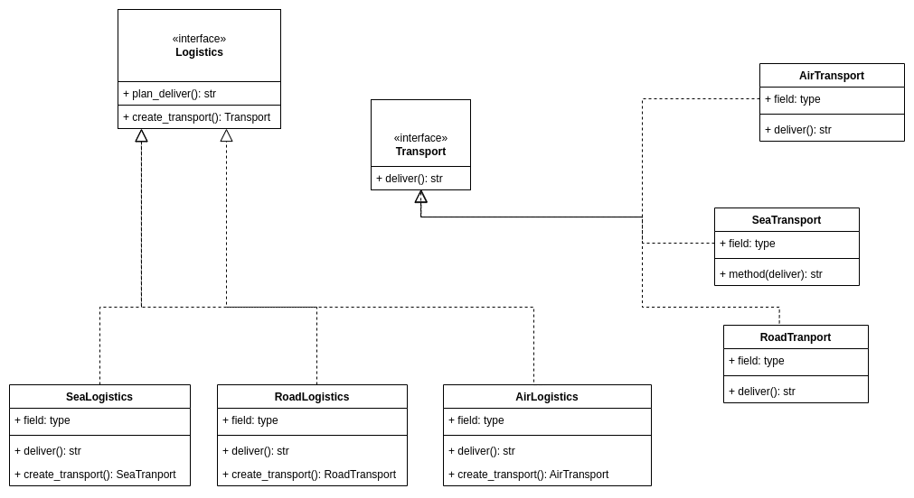

# Design Patterns

Repositório destinado ao estudo de Padrões de códigos orientados a objetos.

## Princípios de OO

**código presente em** : [poo](/poo/)

Explicação presente em : [poo_principles](/poo/readme.md)

## SOLID 

**código presente em** : [code](/solid/)

Explicação presente em : [solid_principles](/solid/readme.md)

## Padrões criacionais 

### Factoy method

Fornece uma interface para criar objetos em uma superclasse, permitindo que as subclasses alterem o tipo de objetos que são criados.

## Referências

- https://refactoring.guru/design-patterns
