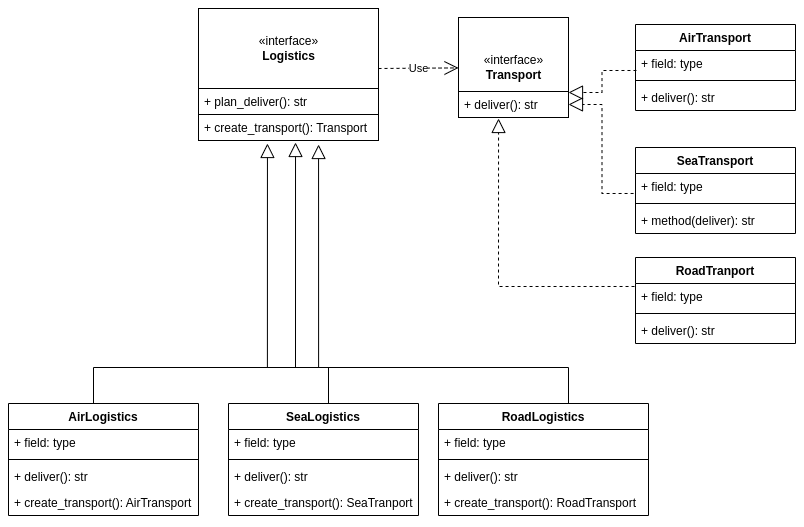

# Design Patterns

Repositório destinado ao estudo de Padrões de códigos orientados a objetos.

## Princípios de OO

Implementação

Herança

Dependência

Associação

## Padrões criacionais 

### Factoy method

Fornece uma interface para criar objetos em uma superclasse, permitindo que as subclasses alterem o tipo de objetos que são criados.

## Referências

- https://refactoring.guru/design-patterns