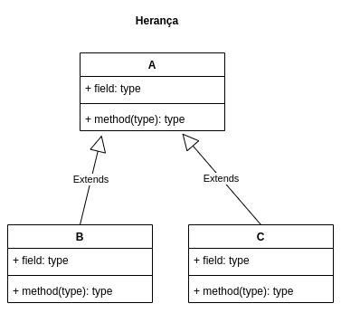
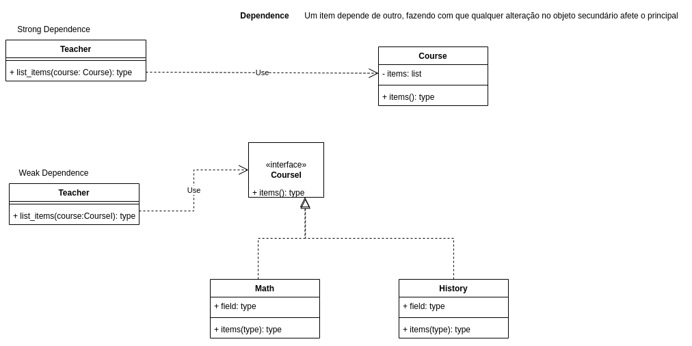
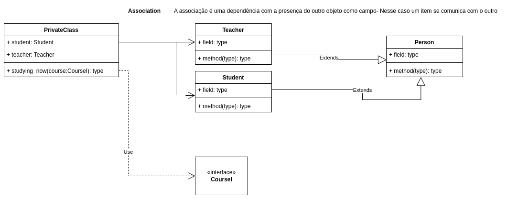

# Princípios de orientação a objetos

## Implementação

## Herança

código presente em : [Herança](/Inheritance/index.py)

## Dependência

código presente em : [Dependência](/dependency/index.py)

## Associação

código presente em : [Associação](/association/index.py)

