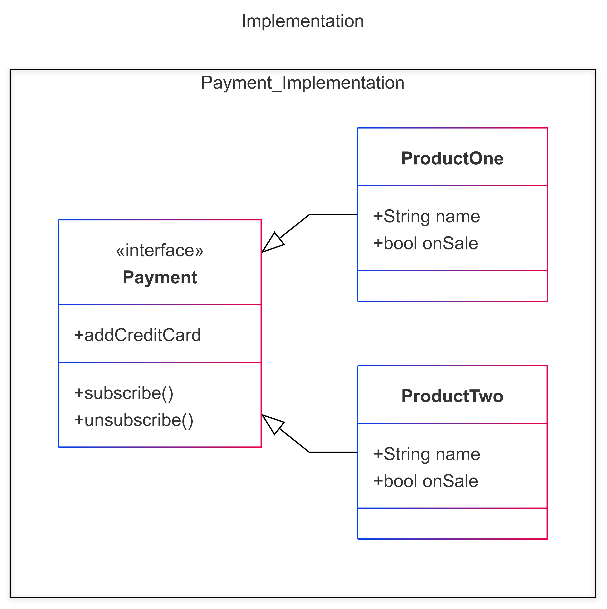

# Princípios de orientação a objetos

## Implementação

## Herança

**código presente em** : [Herança](/Inheritance/index.py)

## Dependência

**código presente em** : [Dependência](/1-dependency/index.py)

## Associação

**código presente em** : [Associação](/2-association/index.py)

**Panorama Geral** 

**(Trecho retirado do livro Mergulho nos padrões de projeto - Páginas 26 e27):**

- Dependência: Classe A pode ser afetada por mudanças na
classe B.

- Associação: Objeto A sabe sobre objeto B. Classe A depende
de B.

- Agregação: Objeto A sabe sobre objeto B, e consiste de B.
Classe A depende de B.

- Composição: Objeto A sabe sobre objeto B, consiste de B, e ge-
rencia o ciclo de vida de B. Classe A depende de B.

- Implementação: Classe A define métodos declarados na inter-
face B. objetos de A podem ser tratados como B. Classe A de-
pende de B.

- Herança: Classe A herda a interface e implementação da classe
B mas pode estendê-la. Objets de A podem ser tratados como
B. Classe A depende de B.

## Referências

- Shvets,Alexander -  Mergulho nos Padrões de projeto (2022)